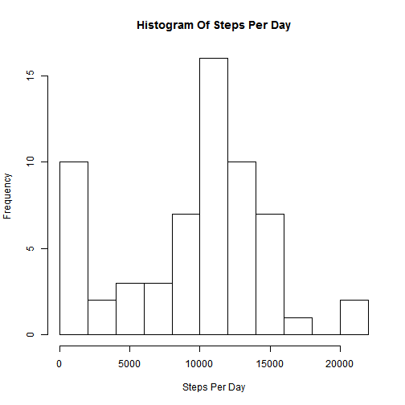
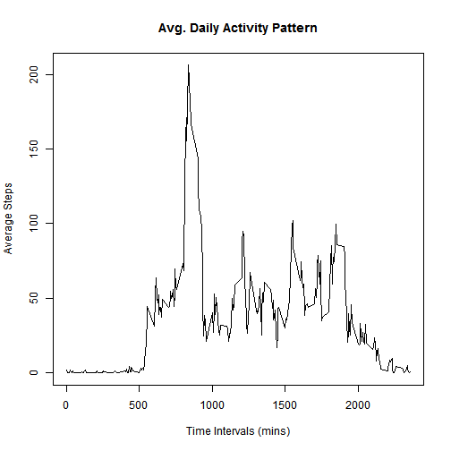
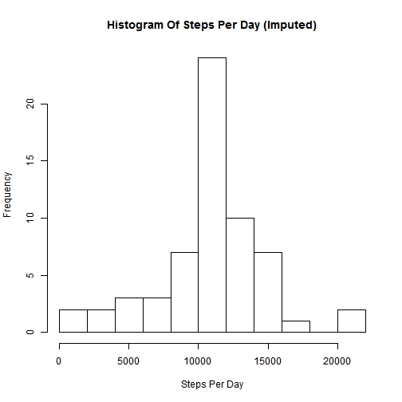
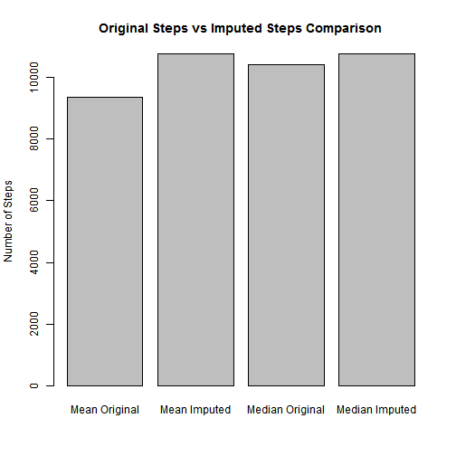
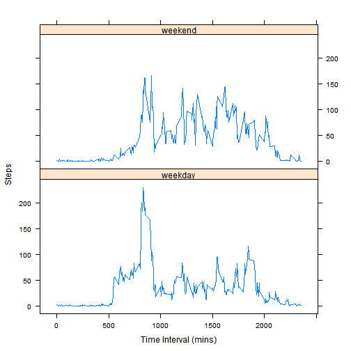

---
title: "Activity Monitoring"
author: "Viseshraj Ethirajan"
date: "February 4, 2016"
output: html_document
---

### Introduction:

It is now possible to collect a large amount of data about personal movement using activity monitoring devices such as a Fitbit, Nike Fuelband, or Jawbone Up. These type of devices are part of the "quantified self" movement - a group of enthusiasts who take measurements about themselves regularly to improve their health, to find patterns in their behavior, or because they are tech geeks. But these data remain under-utilized both because the raw data are hard to obtain and there is a lack of statistical methods and software for processing and interpreting the data.

### Loading and preprocessing the data

```r
activity <- read.csv("./repdata-data-activity/activity.csv")
activity$interval <- as.factor(activity$interval)
str(activity)
```

```
## 'data.frame':	17568 obs. of  3 variables:
##  $ steps   : int  NA NA NA NA NA NA NA NA NA NA ...
##  $ date    : Factor w/ 61 levels "2012-10-01","2012-10-02",..: 1 1 1 1 1 1 1 1 1 1 ...
##  $ interval: Factor w/ 288 levels "0","5","10","15",..: 1 2 3 4 5 6 7 8 9 10 ...
```

### What is mean total number of steps taken per day?

```r
stepsperday <- tapply(activity$steps,activity$date,sum,na.rm=TRUE)
hist(stepsperday,xlab = "Steps Per Day", main = "Histogram Of Steps Per Day", breaks=10)
```



```r
#Mean of the total number of steps taken per day
mean(stepsperday)
```

```
## [1] 9354.23
```

```r
#Median of the total number of steps taken per day
median(stepsperday,na.rm = TRUE)
```

```
## [1] 10395
```

### What is the average daily activity pattern?

```r
meanstepsinterval <- tapply(activity$steps,activity$interval,mean,na.rm=TRUE)
plot(names(meanstepsinterval),meanstepsinterval,type = "l",main = "Avg. Daily Activity Pattern",xlab = "Time Intervals (mins)",ylab = "Average Steps")
```



```r
#Interval with max average steps across dates
names(meanstepsinterval)[which.max(meanstepsinterval)]
```

```
## [1] "835"
```

### Imputing missing values

```r
#Total number of missing values in the data set
length(activity[is.na(activity)])
```

```
## [1] 2304
```

```r
#Filling missing values in the data set with the mean steps on that interval
imputedactivity <- activity

for(i in 1:length(imputedactivity$steps)) {
  if(is.na(imputedactivity$steps[i])){
    imputedactivity$steps[i] <- meanstepsinterval[imputedactivity$interval[i]]
  }
}
str(imputedactivity)
```

```
## 'data.frame':	17568 obs. of  3 variables:
##  $ steps   : num  1.717 0.3396 0.1321 0.1509 0.0755 ...
##  $ date    : Factor w/ 61 levels "2012-10-01","2012-10-02",..: 1 1 1 1 1 1 1 1 1 1 ...
##  $ interval: Factor w/ 288 levels "0","5","10","15",..: 1 2 3 4 5 6 7 8 9 10 ...
```

### Impact of Imputing

```r
imputedstepsperday <- tapply(imputedactivity$steps,imputedactivity$date,sum,na.rm=TRUE)
hist(imputedstepsperday,xlab = "Steps Per Day", main = "Histogram Of Steps Per Day (Imputed)", breaks=10)
```



```r
#Mean of the total number of steps taken per day (Imputed)
mean(imputedstepsperday)
```

```
## [1] 10766.19
```

```r
#Median of the total number of steps taken per day (Imputed)
median(imputedstepsperday,na.rm = TRUE)
```

```
## [1] 10766.19
```
**Post Imputing the NAs in number of steps with the mean of the interval it is observed that the distribution is symmetric as the Mean and the Medain are the same.**


```r
barplot(c(mean(stepsperday),mean(imputedstepsperday),median(stepsperday,na.rm = TRUE),median(imputedstepsperday,na.rm = TRUE)),names.arg = c("Mean Original","Mean Imputed","Median Original","Median Imputed"),main = "Original Steps vs Imputed Steps Comparison",ylab = "Number of Steps")
```



```r
#Percent change in Mean
dfmean <- data.frame(MeanOriginalSteps = mean(stepsperday), MeanImputedSteps = mean(imputedstepsperday),PercentChange=(mean(imputedstepsperday)-mean(stepsperday))/mean(stepsperday)*100) 
dfmean
```

```
##   MeanOriginalSteps MeanImputedSteps PercentChange
## 1           9354.23         10766.19      15.09434
```

```r
#Percent change in Median
dfmedian <- data.frame(MedianOriginalSteps = median(stepsperday), MedianImputedSteps = median(imputedstepsperday),PercentChange=(median(imputedstepsperday)-median(stepsperday))/median(stepsperday)*100) 
dfmedian
```

```
##   MedianOriginalSteps MedianImputedSteps PercentChange
## 1               10395           10766.19      3.570839
```

### Are there differences in activity patterns between weekdays and weekends?

```r
library(lubridate)
imputedactivity$day <- as.factor(as.character(lapply(as.character(imputedactivity$date),function(x) if(weekdays(ymd(x)) %in% c("Saturday","Sunday")){"weekend"}else{"weekday"})))
imputedmeanstepsinterval <- tapply(imputedactivity$steps,interaction(imputedactivity$interval,imputedactivity$day),mean)
imputedmeandayinterval <- data.frame(steps = as.numeric(imputedmeanstepsinterval),
                                     interval = as.integer(substr(names(imputedmeanstepsinterval),1,nchar(names(imputedmeanstepsinterval))-8)),
                                     day = substr(names(imputedmeanstepsinterval),nchar(names(imputedmeanstepsinterval))-6,nchar(names(imputedmeanstepsinterval))))

library(lattice)
xyplot(steps~interval|day,data=imputedmeandayinterval,layout=c(1,2),type="l",xlab = "Time Interval (mins)",ylab = "Steps")
```


